# C

## EASY-2

### Step 1.指针与结构体

#### 什么是指针？

1.1 与变量规则相似，整数前缀int，双浮点数缀float,字符型用char，不同之处为指针变量名前必须加*  
1.2 其在同一编程环境中大小固定，跟操作系统和编译器是几位有关  
2.1 输出20 10  
2.2前三行定义指针变量p使其存储x的内存地址，并在第三行将x的改为20；下面三行，先是定义数组arr,并让q储存arr[0]的地址，第三行先是去arr[0]处的值并让其自增为4，后让q对应的值自增后移一位并取值arr[1],也就是6，二者相加得10  
3.1 野指针指指向未知、非法或已销毁内容的指针  
3.2 野指针如果访问操作系统核心内容会导致报错退出；如果指向正常变量，修改它会导致其他变量改变导致输出错误或报错且不易被发现  
3.3 为了避免产生野指针应该：1.定义指针是初始化指针；2.指针释放后立即设为NULL；3.函数中返回指针时确保指向的内存是全局的、静态的或动态分配的；4.使用指针前判断其是否为NULL  
4.1 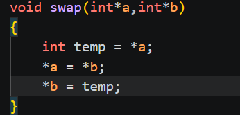  

#### 什么是结构体？

1.1 typedef struct{  
       char name[10];  
       char sex;  
       int age;  
       double heigh;  
    }Student;  

2.1 结构体指针是储存结构体内存地址的指针，是种较为快捷访问结构体内数据的方式，且可以对应修改结构体内变量的值  
3.1 结构体内存对齐原则是为让CPU较快读取数据将数据摆放整齐的规则：第一个成员放在偏移量为0的位置，第二个成员开始每个成员的偏移量必须是自己的整数倍不够前面补空字节；整个结构体总大小必须是最大成员的整数倍，不够后面补空字节  
3.2 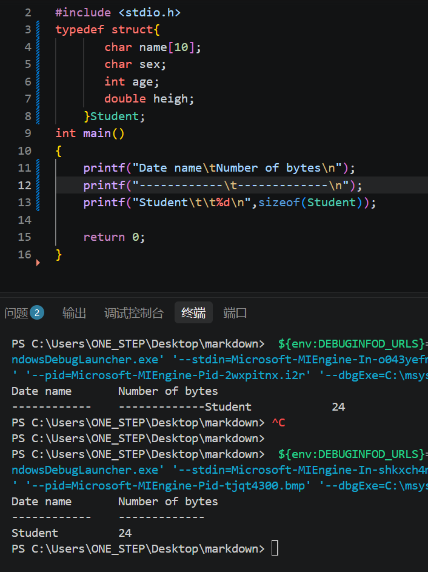     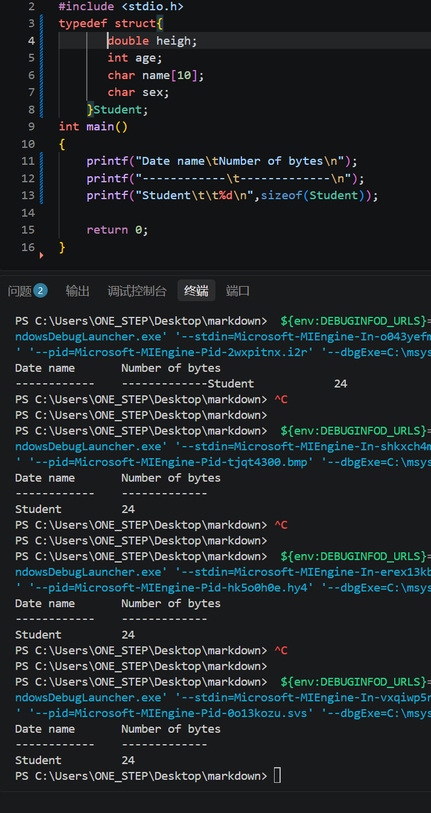 理论上是会变，因为不同排序方式需要填的空字节不同  

### Step 2.链操作

#### 什么是链表？

1.1 数组储存成连续排列，占用一整块连续的空间，仅储存数据；链表的每个元素在内存中随机散落，不连续，每个节点除了存数据还要存个指针记录下一个节点地址  
2.1 单向链表节点的结构特点为分成两个模块，一部分储存数据，另一部分储存关于下一节点储存位置的指针，最末尾节点指针为NULL  
2.2 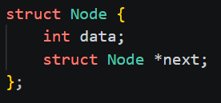  

#### 实现基本的链操作

1.1 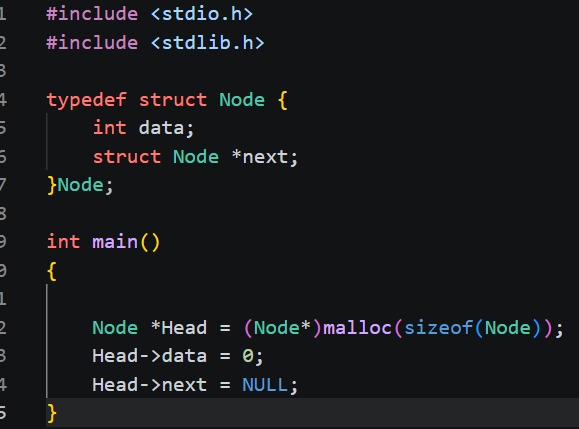  

#### 添加元素

1.1   
2.1 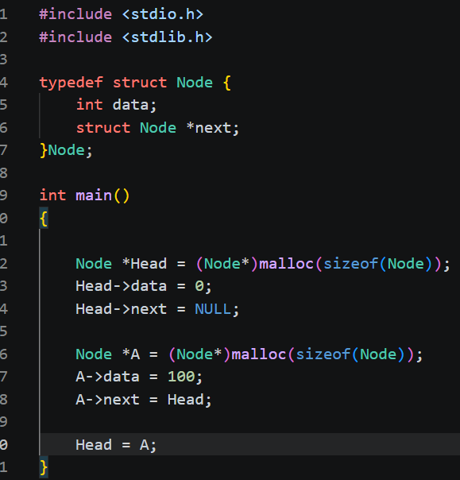另一种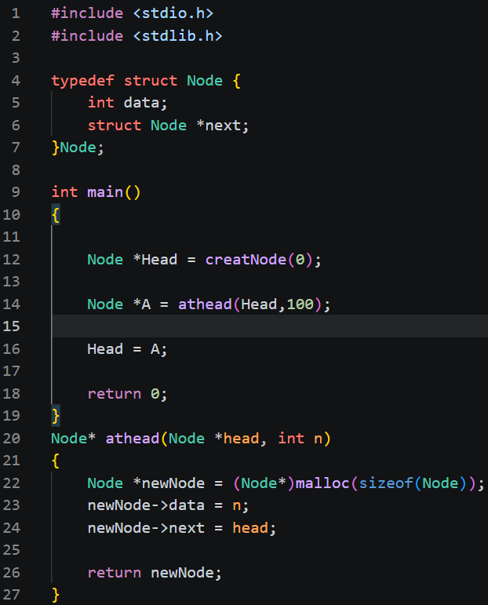  
3.1 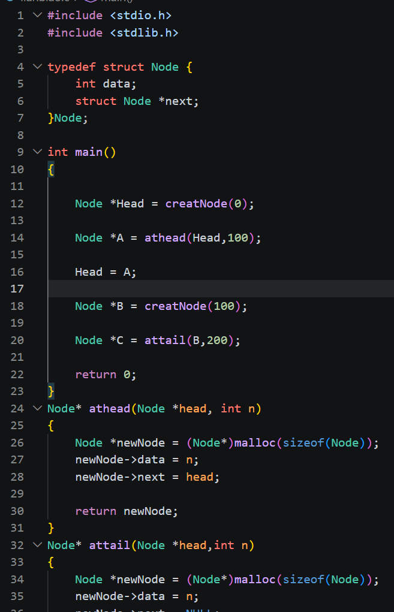 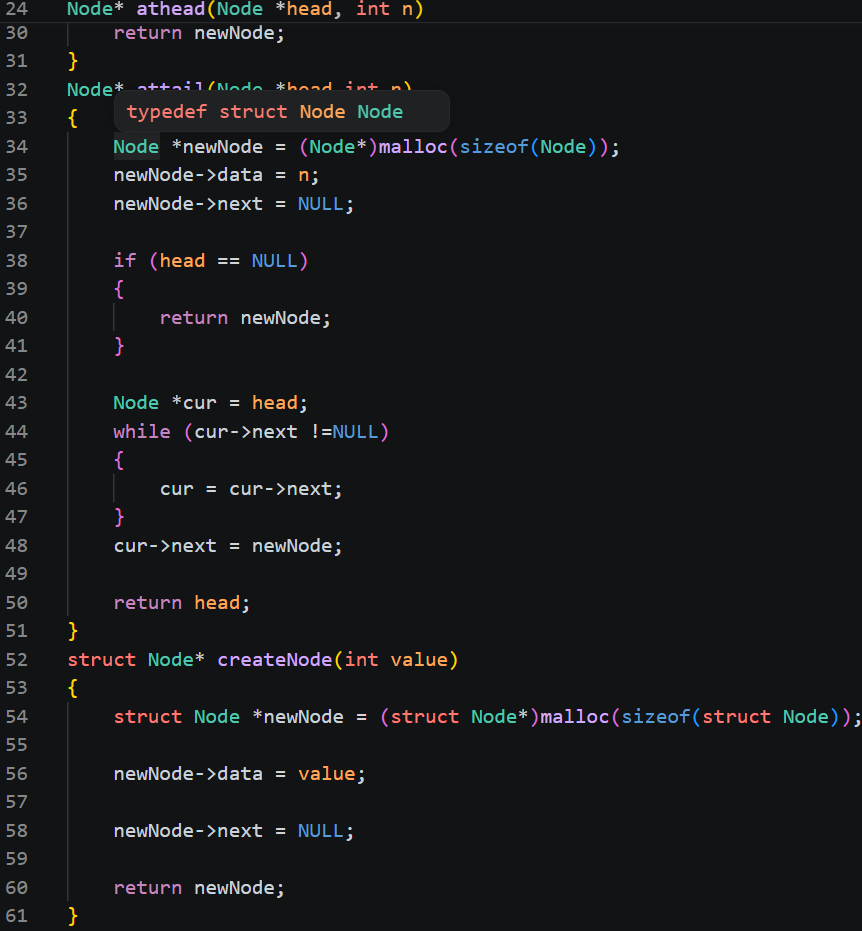  

#### 查找元素

1.1 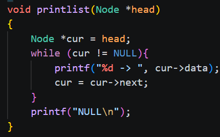  
2.1 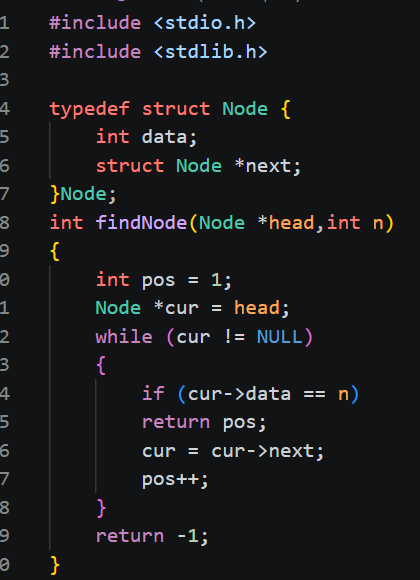  

#### 删除和更改

1.1 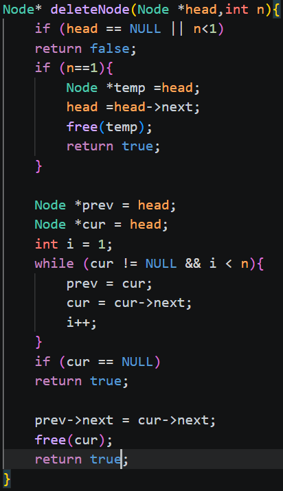  

#### 反转函数

1.1 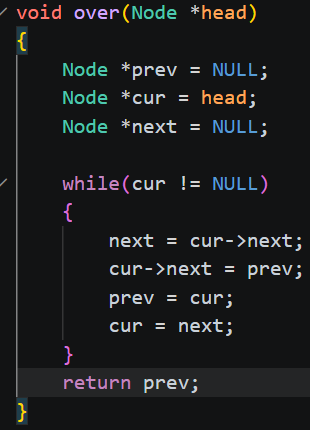  